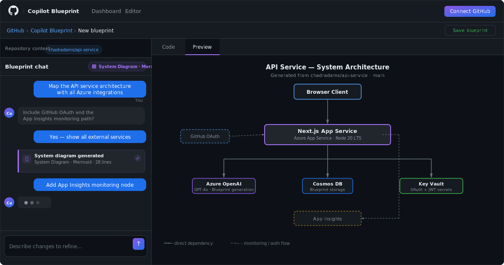
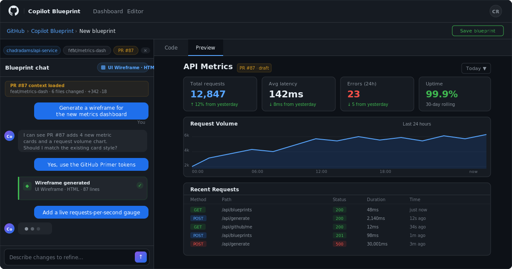

# Copilot Blueprint

> AI-powered UI wireframes, system diagrams, visual designs, and code blueprints — built into GitHub.

Copilot Blueprint is a GitHub-themed design tool that generates production-ready design artifacts from natural language. It connects to **Azure AI Foundry** as its AI backend, renders output in a Monaco code editor with live preview, and integrates directly with GitHub for repo/issue context, OAuth authentication, and blueprint persistence.


### System diagrams



### PR & issue linking



## Features

- **UI Wireframes** — Low-fidelity HTML layouts for pages and components
- **System Diagrams** — Mermaid-based architecture diagrams, ERDs, sequence diagrams, and flowcharts
- **Visual Designs** — High-fidelity mockups using GitHub's Primer dark theme
- **Code Blueprints** — TypeScript file trees, interfaces, and module skeletons
- **Conversational generation** — Three-phase AI flow: clarify → generate → refine
- **Streaming output** — Tokens stream live via Azure AI Foundry into the Monaco editor
- **Live preview** — HTML outputs render in a sandboxed iframe; Mermaid diagrams render inline
- **GitHub OAuth** — Connect your GitHub account directly in the app
- **Repo context** — Load any repo's file tree + README + tech stack into the AI prompt
- **Issue & PR linking** — Reference an issue or PR to ground designs in real requirements
- **Blueprint persistence** — Save, browse, search, and filter blueprints via Cosmos DB
- **GitHub-native UI** — Primer color system, dark theme, breadcrumb navigation

## Tech stack

| Layer | Technology |
|---|---|
| Framework | Next.js 14 (App Router) |
| Language | TypeScript |
| Styling | Tailwind CSS + GitHub Primer tokens |
| Editor | Monaco Editor (`@monaco-editor/react`) |
| Diagrams | Mermaid.js |
| AI backend | Azure AI Foundry (Azure OpenAI — GPT-4o) |
| Auth | GitHub OAuth 2.0 + JWT (`jose`) |
| Database | Azure Cosmos DB (NoSQL) |
| Secrets | Azure Key Vault (Key Vault References) |
| Infrastructure | Terraform (azurerm ~> 3.100) |
| Observability | Azure Application Insights + Log Analytics |

---

## Development

### Prerequisites

- Node.js >= 20 LTS
- An Azure subscription with access to Azure OpenAI (GPT-4o)
- A GitHub OAuth App (for auth + GitHub integration features)

### 1. Clone and install

```bash
git clone https://github.com/chadradams/github-blueprint.git
cd github-blueprint
npm install
```

### 2. Create a GitHub OAuth App

1. Go to [github.com/settings/developers](https://github.com/settings/developers) → **New OAuth App**
2. Fill in the form:
   - **Homepage URL:** `http://localhost:3000`
   - **Authorization callback URL:** `http://localhost:3000/api/github/callback`
3. Click **Register application**
4. Copy the **Client ID**
5. Click **Generate a new client secret** and copy it immediately — it won't be shown again

> You'll add a second callback URL for production after deploying (`https://<app>.azurewebsites.net/api/github/callback`).

### 3. Configure environment variables

```bash
cp .env.example .env.local
```

Open `.env.local` and fill in the values. There are two paths depending on how you want to authenticate to Azure:

---

**Path A — API keys (quickest for local dev)**

Get these from the Azure Portal or via `terraform output -raw env_local_snippet` after deploying:

```env
AZURE_OPENAI_ENDPOINT=https://your-resource.openai.azure.com
AZURE_OPENAI_KEY=your-openai-api-key
AZURE_OPENAI_DEPLOYMENT=gpt-4o
AZURE_OPENAI_API_VERSION=2024-02-01

COSMOS_ENDPOINT=https://your-cosmos.documents.azure.com:443/
COSMOS_KEY=your-cosmos-primary-key

GITHUB_CLIENT_ID=your-github-oauth-client-id
GITHUB_CLIENT_SECRET=your-github-oauth-client-secret

JWT_SECRET=your-32-char-minimum-secret   # openssl rand -hex 32
```

---

**Path B — Keyless via `az login` (mirrors production)**

Omit `AZURE_OPENAI_KEY` and `COSMOS_KEY`. The app uses `DefaultAzureCredential`, which picks up your active `az login` session. You must grant your account the same roles the App Service managed identity holds:

```bash
# Log in and set your subscription
az login
az account set --subscription <your-subscription-id>

# Get the resource names from Terraform outputs
RG=$(cd terraform && terraform output -raw resource_group_name)
OAI=$(cd terraform && terraform output -raw openai_resource_name 2>/dev/null || echo "<openai-resource-name>")
COSMOS=$(cd terraform && terraform output -raw cosmos_account_name 2>/dev/null || echo "<cosmos-account-name>")
MY_ID=$(az ad signed-in-user show --query id -o tsv)

# Grant your account Cognitive Services OpenAI User on the OpenAI resource
az role assignment create \
  --role "Cognitive Services OpenAI User" \
  --assignee "$MY_ID" \
  --scope "/subscriptions/$(az account show --query id -o tsv)/resourceGroups/$RG/providers/Microsoft.CognitiveServices/accounts/$OAI"

# Grant your account Cosmos DB Built-in Data Contributor on the Cosmos account
az cosmosdb sql role assignment create \
  --resource-group "$RG" \
  --account-name   "$COSMOS" \
  --role-definition-id "00000000-0000-0000-0000-000000000002" \
  --principal-id   "$MY_ID" \
  --scope          "/subscriptions/$(az account show --query id -o tsv)/resourceGroups/$RG/providers/Microsoft.DocumentDB/databaseAccounts/$COSMOS"
```

Then set only the non-key values in `.env.local`:

```env
AZURE_OPENAI_ENDPOINT=https://your-resource.openai.azure.com
AZURE_OPENAI_DEPLOYMENT=gpt-4o
AZURE_OPENAI_API_VERSION=2024-02-01

COSMOS_ENDPOINT=https://your-cosmos.documents.azure.com:443/

GITHUB_CLIENT_ID=your-github-oauth-client-id
GITHUB_CLIENT_SECRET=your-github-oauth-client-secret

JWT_SECRET=your-32-char-minimum-secret
```

---

### 4. Start the dev server

```bash
npm run dev
```

Open [http://localhost:3000](http://localhost:3000). The app hot-reloads on file save.

### Useful scripts

| Command | Description |
|---|---|
| `npm run dev` | Start Next.js dev server with hot reload |
| `npm run build` | Production build (outputs to `.next/`) |
| `npm run start` | Serve the production build locally |
| `npm run lint` | Run ESLint across all source files |

### How the AI generation works

`POST /api/generate` accepts `{ messages, type, currentArtifact?, githubContext? }` and proxies a streaming request to Azure OpenAI. The response phase is determined server-side:

| Phase | Condition | AI behaviour |
|---|---|---|
| **clarify** | First user message, no artifact | Asks 2–3 questions to refine the request |
| **generate** | Second+ message, no artifact | Outputs `__BLUEPRINT_ARTIFACT__` prefix + full artifact |
| **refine** | Any message with existing artifact | Patches the artifact, re-emits with prefix |

The `__BLUEPRINT_ARTIFACT__` sentinel is stripped client-side and routes the stream to the Monaco editor rather than the chat thread.

```
Browser → POST /api/generate → AzureOpenAI streaming
                                      ↓ chunks
                             ReadableStream → fetch reader
                                      ↓
                    starts with ARTIFACT_MARKER? → setOutput()  (Monaco)
                                               no → updateMessage()  (chat)
```

### GitHub context injection

When a repo or issue is loaded via `GitHubContextBar`, the context is sent with every generate request and appended to all three phase system prompts:

```
--- GitHub Context ---
Repository: owner/repo  (TypeScript · private)
Branch: main
Files (47): src/components/Button.tsx, src/lib/api.ts, …
README: …first 800 chars…
Tech stack (package.json): react, next, tailwind…
Issue #42: "Redesign the settings page"
  Body: …
  Comments: …
--- End GitHub Context ---
```

The AI uses this to match naming conventions, tech stack, and code style.

### Project structure

```
github-blueprint/
├── app/
│   ├── layout.tsx                       # Root layout with GitHubNav
│   ├── page.tsx                         # Feature landing page
│   ├── dashboard/page.tsx               # Blueprint gallery (search, filter, stats)
│   ├── editor/page.tsx                  # Split-panel editor
│   └── api/
│       ├── generate/route.ts            # Streaming Azure OpenAI proxy
│       ├── blueprints/
│       │   ├── route.ts                 # GET list / POST create
│       │   └── [id]/route.ts            # GET / PATCH / DELETE (ownership-checked)
│       └── github/
│           ├── auth/route.ts            # Start OAuth flow
│           ├── callback/route.ts        # Handle OAuth callback, set session cookie
│           ├── me/route.ts              # Return current session
│           ├── repos/route.ts           # List authenticated user's repos
│           ├── repo-context/route.ts    # Build repo context text for AI
│           └── issue/route.ts           # Fetch issue or PR context text
├── components/
│   ├── GitHubNav.tsx                    # Top nav — shows avatar or Connect GitHub CTA
│   └── editor/
│       ├── ChatPanel.tsx                # Chat thread with type badge + streaming
│       ├── ArtifactPanel.tsx            # Monaco editor + preview tabs
│       └── GitHubContextBar.tsx         # Repo/branch/issue picker
├── lib/
│   ├── types.ts                         # All shared types + constants
│   ├── prompts.ts                       # System prompts for clarify/generate/refine
│   ├── auth.ts                          # JWT session helpers (jose)
│   ├── cosmos.ts                        # Cosmos DB CRUD (graceful no-op when unconfigured)
│   └── github.ts                        # GitHub API helpers (repos, tree, context builder)
├── scripts/
│   └── deploy.sh                        # End-to-end Azure deploy script
└── terraform/                           # Azure infrastructure (see Infrastructure section)
```

### Environment variables

| Variable | Required | Description |
|---|---|---|
| `AZURE_OPENAI_ENDPOINT` | Yes | Azure OpenAI resource URL |
| `AZURE_OPENAI_KEY` | Local dev only | API key — omit in production; managed identity is used instead |
| `AZURE_OPENAI_DEPLOYMENT` | Yes | Model deployment name (e.g. `gpt-4o`) |
| `AZURE_OPENAI_API_VERSION` | No | API version — default `2024-02-01` |
| `COSMOS_ENDPOINT` | No* | Cosmos DB account URL — blueprints disabled without it |
| `COSMOS_KEY` | Local dev only | Primary key — omit in production; managed identity is used instead |
| `GITHUB_CLIENT_ID` | No* | GitHub OAuth App client ID — GitHub features disabled without it |
| `GITHUB_CLIENT_SECRET` | No* | GitHub OAuth App client secret |
| `JWT_SECRET` | No* | Min 32-char secret for signing session cookies |
| `APPLICATIONINSIGHTS_CONNECTION_STRING` | No | Enables local telemetry |

*Required for full functionality; the app degrades gracefully without them.

---

## Infrastructure (Terraform)

The `terraform/` directory provisions all required Azure resources in a single `apply`.

### Prerequisites

- [Terraform](https://developer.hashicorp.com/terraform/install) >= 1.5
- [Azure CLI](https://learn.microsoft.com/cli/azure/install-azure-cli) >= 2.50

### Quick deploy (automated script)

```bash
./scripts/deploy.sh --tenant <your-tenant-id> --subscription <your-subscription-id>
```

The script handles login, `terraform init/plan/apply`, Next.js build, and `az webapp deploy` in one shot. Use `--env prod` for production.

**Flags:**

| Flag | Description |
|---|---|
| `--tenant ID` | Azure tenant ID (or set `ARM_TENANT_ID`) |
| `--subscription ID` | Azure subscription ID (or set `ARM_SUBSCRIPTION_ID`) |
| `--env dev\|staging\|prod` | Deployment environment tag (default: `dev`) |
| `--skip-infra` | Skip Terraform — only build and deploy the app |
| `--skip-app` | Skip build/deploy — only run Terraform |

**Non-interactive / CI (service principal):**

```bash
export ARM_TENANT_ID=<tenant>
export ARM_SUBSCRIPTION_ID=<subscription>
export ARM_CLIENT_ID=<sp-app-id>
export ARM_CLIENT_SECRET=<sp-secret>

./scripts/deploy.sh --env prod
```

### Manual deploy

```bash
cd terraform
cp terraform.tfvars.example terraform.tfvars
# Fill in terraform.tfvars (see Terraform variables below)

az login --tenant <your-tenant-id>
terraform init
terraform plan -out=blueprint.tfplan
terraform apply blueprint.tfplan

# Get .env.local values
terraform output -raw env_local_snippet
```

Then build and ship the app:

```bash
npm ci && npm run build
zip -r app.zip .next public package.json package-lock.json next.config.mjs

az webapp deploy \
  --resource-group $(cd terraform && terraform output -raw resource_group_name) \
  --name        $(cd terraform && terraform output -raw web_app_name) \
  --src-path    app.zip \
  --type        zip
```

### Deployed resources

| Resource | Name pattern | Purpose |
|---|---|---|
| `azurerm_resource_group` | `<project>-<env>-rg` | Container for all resources |
| `azurerm_cognitive_account` | `<project>-oai-<suffix>` | Azure OpenAI / AI Foundry endpoint |
| `azurerm_cognitive_deployment` | `gpt-4o` | GPT-4o model deployment |
| `azurerm_cosmosdb_account` | `<project>-cosmos-<suffix>` | Blueprint persistence (NoSQL) |
| `azurerm_key_vault` | `<project>-kv-<suffix>` | GitHub OAuth secret + JWT secret storage |
| `azurerm_service_plan` | `<project>-plan-<suffix>` | Linux App Service Plan |
| `azurerm_linux_web_app` | `<project>-app-<suffix>` | Next.js host with managed identity |
| `azurerm_log_analytics_workspace` | `<project>-logs-<suffix>` | Centralised log sink |
| `azurerm_application_insights` | `<project>-insights-<suffix>` | Performance + error monitoring |

All names include a random 6-character suffix for global uniqueness.

### Terraform variables

| Variable | Default | Description |
|---|---|---|
| `project_name` | `copilot-blueprint` | Base name for all resources |
| `environment` | `dev` | Tag: `dev`, `staging`, or `prod` |
| `location` | `eastus` | Region for App Service + observability |
| `openai_location` | `eastus` | Region for Azure OpenAI (must support GPT-4o) |
| `openai_deployment_name` | `gpt-4o` | Model deployment name |
| `openai_model_version` | `2024-05-13` | GPT-4o model version |
| `openai_capacity` | `10` | Tokens-per-minute capacity (in thousands) |
| `app_service_sku` | `B1` | App Service SKU — use `P1v3`+ for production |
| `log_retention_days` | `30` | Log Analytics retention period |
| `github_client_id` | `""` | GitHub OAuth App client ID |
| `github_client_secret` | `""` | GitHub OAuth App client secret (stored in Key Vault) |
| `jwt_secret` | `""` | Session signing secret — min 32 chars (`openssl rand -hex 32`) |

### Secrets management

The App Service has a **System-Assigned Managed Identity** — no credentials are stored in App Service config or Terraform state:

| Secret | Mechanism |
|---|---|
| `AZURE_OPENAI_KEY` | Not used — managed identity holds `Cognitive Services OpenAI User` role |
| `COSMOS_KEY` | Not used — managed identity holds `Cosmos DB Built-in Data Contributor` role |
| `GITHUB_CLIENT_SECRET` | Key Vault Reference (`@Microsoft.KeyVault(...)`) |
| `JWT_SECRET` | Key Vault Reference (`@Microsoft.KeyVault(...)`) |

For **local development**, set `AZURE_OPENAI_KEY` and `COSMOS_KEY` in `.env.local`, or run `az login` with your account granted the same roles — `DefaultAzureCredential` will pick up your CLI session automatically.

### Post-deploy configuration checklist

After `terraform apply` (or `./scripts/deploy.sh`) completes, run through these steps:

**1. Get your app URL**
```bash
cd terraform && terraform output -raw web_app_url
```

**2. Add the production callback URL to your GitHub OAuth App**

Go to [github.com/settings/developers](https://github.com/settings/developers) → your OAuth App → **Edit** and add a second callback URL:
```
https://<your-app>.azurewebsites.net/api/github/callback
```

**3. Verify Key Vault secret resolution**

App Service resolves Key Vault References at startup. Check that `GITHUB_CLIENT_SECRET` and `JWT_SECRET` show as `Key vault Reference` (not `Custom`) in the portal, or run:
```bash
APP=$(cd terraform && terraform output -raw web_app_name)
RG=$(cd terraform && terraform output -raw resource_group_name)
az webapp config appsettings list --name "$APP" --resource-group "$RG" \
  --query "[?name=='GITHUB_CLIENT_SECRET' || name=='JWT_SECRET']"
```
If the values still show the raw `@Microsoft.KeyVault(...)` string, the managed identity access policy hasn't propagated yet — wait 1–2 minutes and restart the app:
```bash
az webapp restart --name "$APP" --resource-group "$RG"
```

**4. Verify managed identity role assignments**

Confirm the app can reach Azure OpenAI and Cosmos DB without keys by tailing the startup logs:
```bash
az webapp log tail --name "$APP" --resource-group "$RG"
```
A successful start shows `ready on http://0.0.0.0:8080`. Any `401 Unauthorized` or `403 Forbidden` errors from Azure OpenAI or Cosmos DB indicate the role assignments haven't propagated — Azure RBAC can take up to 5 minutes. Restart the app once they're in place.

**5. Set your `.env.local` for local dev**
```bash
cd terraform && terraform output -raw env_local_snippet
```
Paste the output into `.env.local` in the repo root.

**6. Smoke test**

Open `https://<your-app>.azurewebsites.net`, click **Connect GitHub**, authorise the OAuth App, then open the editor and generate a wireframe. Check Application Insights → *Transaction search* to confirm the request was traced.

---

### Tear down

```bash
cd terraform
terraform destroy
```

---

## Observability

### In production (App Service)

`APPLICATIONINSIGHTS_CONNECTION_STRING` and `ApplicationInsightsAgent_EXTENSION_VERSION=~3` are set automatically by Terraform. The Node.js agent auto-instruments HTTP requests, Azure OpenAI dependency calls, and unhandled exceptions — no code changes required.

### In local development

```bash
cd terraform && terraform output -raw app_insights_connection_string
```

Paste the result into `.env.local` as `APPLICATIONINSIGHTS_CONNECTION_STRING`.

### Viewing telemetry

| What | Where in Azure Portal |
|---|---|
| Live request traces | Application Insights → *Transaction search* |
| Failures + exceptions | Application Insights → *Failures* |
| Latency percentiles | Application Insights → *Performance* |
| OpenAI dependency durations | Application Insights → *Performance* → *Dependencies* |
| Custom log queries | Log Analytics → *Logs* (KQL) |

### Useful KQL queries

**Failed generate requests (last 24 h):**
```kusto
requests
| where timestamp > ago(24h)
| where url contains "/api/generate"
| where success == false
| project timestamp, resultCode, duration, cloud_RoleInstance
| order by timestamp desc
```

**p50 / p95 / p99 generation latency by hour:**
```kusto
requests
| where timestamp > ago(7d)
| where url contains "/api/generate"
| summarize
    p50 = percentile(duration, 50),
    p95 = percentile(duration, 95),
    p99 = percentile(duration, 99)
  by bin(timestamp, 1h)
| order by timestamp desc
```

**Azure OpenAI dependency durations:**
```kusto
dependencies
| where timestamp > ago(24h)
| where type == "HTTP"
| where target contains "openai.azure.com"
| summarize avg(duration), max(duration), count() by bin(timestamp, 5m)
| order by timestamp desc
```

---

## Supported blueprint types

| Type | Output format | Preview |
|---|---|---|
| UI Wireframe | HTML | Sandboxed iframe |
| System Diagram | Mermaid | Rendered diagram (mermaid.js) |
| Visual Design | HTML + CSS | Sandboxed iframe |
| Code Blueprint | TypeScript | Code editor only |

---

## License

MIT
